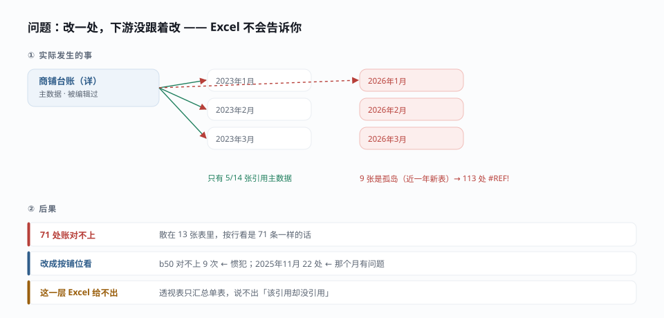
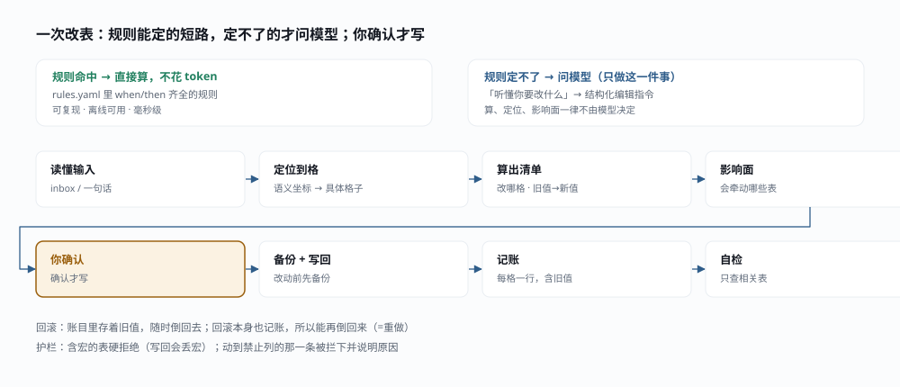
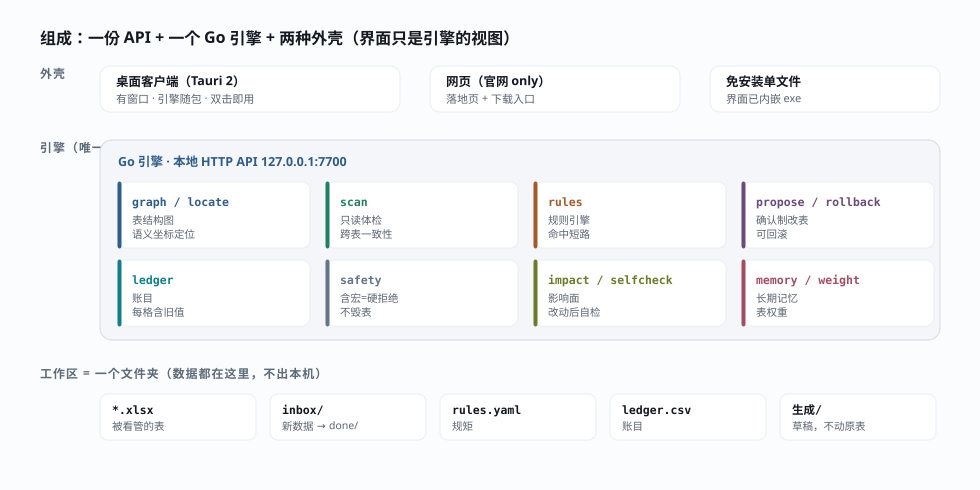

<div align="center">

# gridwright

**你的表，有人替你看着。**

跑在自己机器上的 Excel 台账管家 —— 新数据一进 inbox，它按你定的规矩自动改表；
每一格改动都留账目、能回滚、改完通知你。**数据不出本机。**

[](https://github.com/ark-local-ai/ark-ai/releases/latest)
[](LICENSE)
[](#下载)
[](apps/agent)
[](apps/frontend)

**在线体验：** http://111.231.166.31/

[下载](#下载) · [为什么做这个](#为什么做这个) · [快速开始](#快速开始) · [架构](#架构) · [参与贡献](CONTRIBUTING.md)

</div>

---

## 为什么做这个

财务的台账不是一张表，是**一整个工作簿**：每天实收、月租金、汇总、滞纳金
互相引用，一张表改了，下游未必跟着改。真实现场跑出来的体检结果是这样的：

- 14 张月度表里，**只有 5 张**引用主数据，其余 9 张是孤岛（全部来自最近一年）
- 主数据被编辑后，3 张表的引用断掉，留下 **113 处 `#REF!`**
- 因此 **71 处账对不上**，散落在 13 张表里

这些用 Excel 自己看不出来 —— Excel 不会告诉你"这张表按理该引用主数据，却没有引用"，
也不会按**铺位**把跨 13 张表的问题聚到一起。**这正是 gridwright 要回答的。**

它做三件事：

1. **盯表** —— 体检跨表一致性，把"账对不上"按业务对象（哪个铺位、哪个月）聚出来
2. **改表** —— 你说一句"b50 收到 8 月租金 19354.02"，它算出待改清单；**你确认才改**
3. **留账** —— 每一格改动的旧值都记账，可回滚；回滚本身也记账（所以能重做）

**代码算、模型判**：体检、定位、影响面这些一律是确定性代码算出来的，不花 token、
可复现；模型只负责"听懂你要改什么"。**规则命中的改动连模型都不调用。**

## 它是怎么想的

先看一张图，再决定要不要往下读。

**① 为什么需要它** —— 一张表改了，下游未必跟着改，而 Excel 不会告诉你：



**② 一次改表怎么走** —— 规则能定的短路（不花 token），定不了的才问模型；你确认才写：



**③ 它由什么组成** —— 一份引擎 + 两种外壳，界面只是引擎的视图：



> 图由 `apps/frontend/scripts/gen_diagrams.py` 生成（SVG）。用脚本而非手画：
> 配色取自品牌令牌，改了调色重跑即可，手画的图会悄悄过期。

工作台左侧是"**该查什么**"，不是数据本身 —— 按铺位聚合、按紧急度着色：

```
b50         9 处   差 562.3万     ← 反复出问题的铺位排在前面
2025年11月   22 处                ← 那个月集中出错
```

## 下载

前往 [**Releases**](https://github.com/ark-local-ai/ark-ai/releases/latest) 下载：

| 版本 | 说明 | 适用 |
|---|---|---|
| `gridwright_x.y.z_x64-setup.exe` | 双击安装 · 有窗口 · 引擎随包 | Win10/11 |
| `gridwright-windows-amd64.exe` | 免安装单文件 · 界面已内嵌 | Win10/11 · 不想装 |

> **安装包未做代码签名**，首次运行 Windows 会提示"未知发布者"——
> 点「更多信息 → 仍要运行」即可。要消掉提示需自备代码签名证书。

**第一次打开：** 选一个放表的文件夹（工作区就是文件夹）→ 它自动扫出表之间的联动关系并体检一遍。
看表、体检、账目、联动图**都不需要联网**。

**要它替你改表**，需在设置里填模型接口（任何 OpenAI 兼容接口：Base URL + API Key + 模型名）。
密钥只存在本机 `%APPDATA%\gridwright\config.yaml`，也可以走环境变量 `LLM_API_KEY` 不落盘。

## 快速开始

### 环境要求

| 用途 | 需要 |
|---|---|
| 只跑桌面版 | 无 —— 下载安装包即可 |
| 前端开发 | Node 20+ |
| 引擎 / 打包 | Go 1.21+（会自动拉 1.21 工具链）、Rust（仅打包安装包时需要） |

### 前端（官网）

```bash
cd apps/frontend
npm install
npm run dev        # http://localhost:5173
npm run build      # 产出 dist/
```

### 桌面工作台（Tauri）

```bash
cd apps/desktop
npm install
npm run desktop:dev      # 开发：拉起桌面窗口
npm run desktop:build    # 打包：产出 NSIS 安装包
```

### Go 引擎（手）

```bash
cd apps/agent
go test ./...
go build -o dist/gridwright.exe ./cmd/gridwright

# 直接跑（不用界面）
./dist/gridwright.exe -config config.yaml
# 本地 API：http://127.0.0.1:7700
```

### 一键打包 Windows 安装包

```bash
bash apps/agent/scripts/build-desktop.sh   # 编引擎 → 画安装图 → 编前端 → 出 NSIS 安装包
bash apps/agent/scripts/build-single.sh    # 只出免安装单文件版
```

## 架构

**一份 API + 一个 Go 引擎 + 两种外壳。**

```
apps/
├─ agent/        # Go 引擎（"手"）：盯文件夹、读表、体检、改表、记账
│  ├─ cmd/gridwright/    # 入口：起引擎 + 内嵌界面
│  └─ internal/
│     ├─ graph/  locate/      # 表结构图、语义坐标定位
│     ├─ scan/                # 只读体检（跨表一致性）
│     ├─ rules/               # 规则引擎：命中即短路，不调用模型
│     ├─ propose/ rollback/   # 确认制改表、回滚
│     ├─ ledger/              # 账目（每格一条，含旧值）
│     ├─ safety/              # 含宏的表拒绝写入
│     ├─ impact/ selfcheck/   # 影响面推断、改动后自检
│     ├─ memory/ weight/      # 长期记忆、表权重
│     └─ api/                 # 本地 HTTP API（/api/v1）
├─ frontend/     # Web 前端：官网（React 19 + TS + Vite）
├─ desktop/      # 桌面壳（Tauri 2）：复用 frontend 界面 + 随包引擎
└─ backend/      # 早期 Node 后端（已不参与桌面链路）
```

**引擎是唯一业务实现**，界面只是它的视图。桌面壳启动时探测 `127.0.0.1:7700`，
没有就拉起随包 sidecar；退出时随之退出。

### 工作区约定（一个文件夹）

```
你的台账文件夹/
├─ *.xlsx        # 被看管的表（可多张）
├─ inbox/        # 新数据丢这里 → 处理完移入 done/
├─ rules.yaml    # 规则（记事本可改）
├─ ledger.csv    # 账目（append-only，含旧值 → 可回滚）
└─ 生成/         # 生成的草稿，绝不改动原表
```

### 技术选型里的几个"不"

- **不用 WebSocket，用 SSE**：进度是"服务器单向推给浏览器"，SSE 够用且更轻
- **不重算公式**：excelize 不算公式，界面显示的是 Excel 上次保存的值 —— 并在界面上**明说**
- **不碰含宏的表**：excelize 写回会丢宏，所以**硬拒绝**并说明原因，而不是冒险写
- **定时任务只做只读体检**：定时改表仍要你确认，不无人值守

## 测试

```bash
cd apps/agent && go test ./...     # 144 个用例，覆盖 19 个包
```

## 参与贡献

见 [CONTRIBUTING.md](CONTRIBUTING.md)。提交信息用英文，一个 commit 一个逻辑变更。
更多细节见 [ARCHITECTURE.md](ARCHITECTURE.md) 与 [PAGES.md](PAGES.md)。

## 卸载

**不要直接删安装文件夹**，那样会留下孤儿注册项（控制面板里还留着条目，
但卸载程序已经跟着文件夹没了，点卸载必然失败）。正确的做法：

- 装完后**开始菜单 → gridwright → 卸载 gridwright**
- 或 **设置 → 应用 → 已安装的应用 → gridwright → 卸载**

> 如果你曾经手删过文件夹、现在卸不掉：重新装一次（会装到默认目录），
> 再用上面任一方式卸载即可。这个坑的成因见
> `apps/desktop/src-tauri/installer/hooks.nsh` 的注释。

## 已知限制

- 面板数值以 Excel 打开为准（程序不重算公式）
- 含宏（`.xlsm`）的表拒绝写入
- 仅支持 Windows（Win7/8 已不单独支持；单文件版在 Win10/11 上照常可用）
- 安装包未签名

## 许可

[MIT](LICENSE) © 2026 ark-local-ai
